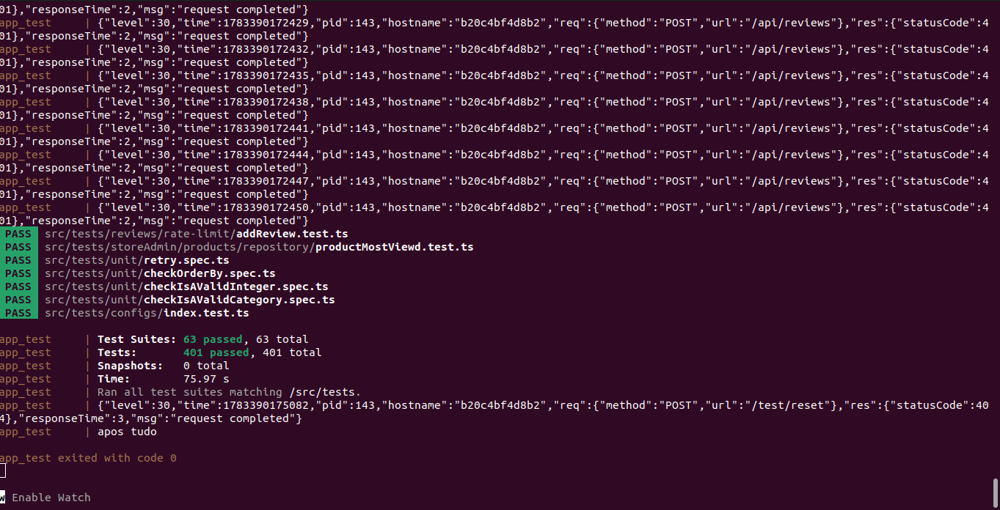
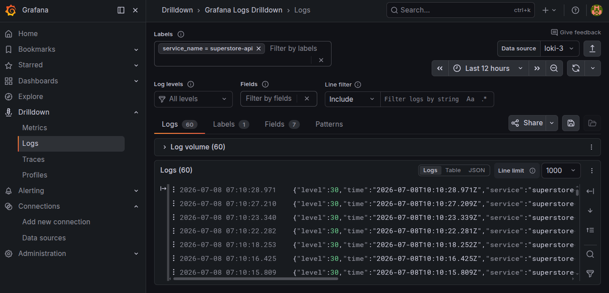
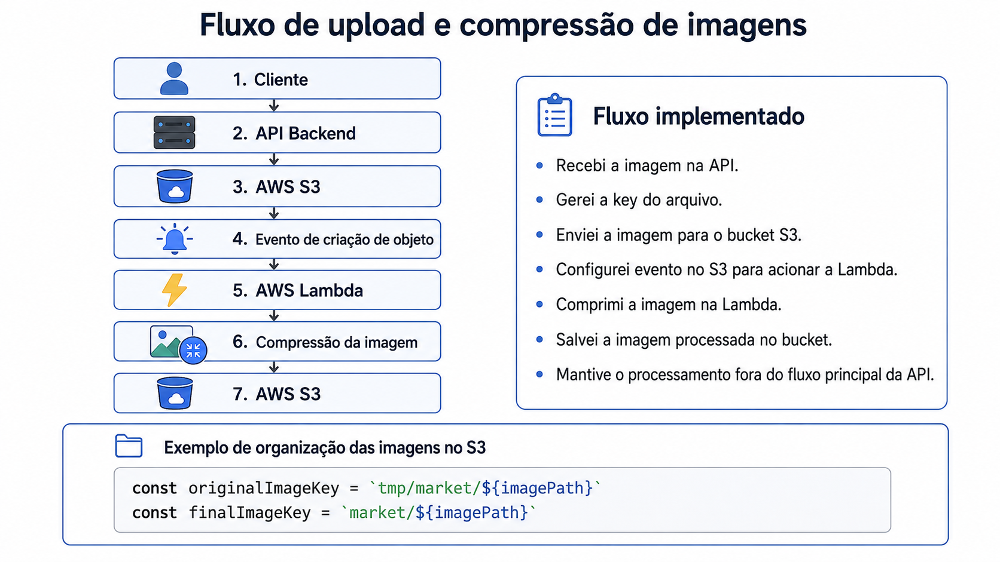

# SuperStore – Backend API

Backend de marketplace onde usuários podem criar lojas, vender produtos, gerenciar pedidos, aplicar cupons, avaliar produtos e realizar compras.

Desenvolvi a API com foco em autenticação, regras de negócio, testes automatizados, cache, logs estruturados, observabilidade, armazenamento de imagens com AWS S3 e compressão assíncrona com AWS Lambda.

## Destaques

* Implementei mais de 500 testes automatizados com Jest, Supertest e Gherkin.
* Cobri fluxos de sucesso, cenários de erro e regras de negócio.
* Configurei CI/CD com execução automática de testes.
* Estruturei logs em JSON com Pino.
* Configurei observabilidade com Grafana, Loki e Grafana Alloy.
* Integrei upload de imagens com AWS S3.
* Configurei AWS Lambda para comprimir imagens após upload no S3.
* Estruturei cache com Redis.
* Containerizei serviços com Docker e Docker Compose.

## Prints

### Testes automatizados





### Logs no Loki



### Dashboard no Grafana

```md

```


## Funcionalidades

### Usuário

* Implementei cadastro e autenticação de usuários.
* Implementei visualização de produtos.
* Implementei adição de produtos ao carrinho.
* Implementei aplicação de cupons de desconto.
* Implementei finalização de pedidos.
* Implementei avaliação e comentários em produtos.

### Loja

* Implementei criação e gerenciamento de lojas.
* Implementei cadastro de produtos.
* Implementei criação de cupons de desconto.
* Implementei dashboard da loja com pedidos e status.
* Implementei gerenciamento de produtos por loja.
* Implementei upload de imagens para produtos e lojas.

## Tecnologias utilizadas

### Backend

* Node.js
* Express.js
* TypeScript
* Prisma ORM
* APIs REST

### Banco de dados e cache

* PostgreSQL
* Redis

### Infraestrutura

* Docker
* Docker Compose
* AWS S3
* AWS Lambda
* AWS EC2
* Route 53

### Observabilidade

* Pino
* Pino HTTP
* Grafana Alloy
* Loki
* Grafana

### Testes

* Jest
* Supertest
* Gherkin
* GitHub Actions

## Fluxo de upload e compressão de imagens


## Testes

Implementei mais de 500 testes automatizados cobrindo serviços, endpoints, regras de negócio e integrações.

### Cobertura aplicada

* Testei autenticação e autorização.
* Testei criação de usuários.
* Testei criação de lojas.
* Testei cadastro de produtos.
* Testei carrinho de compras.
* Testei criação e aplicação de cupons.
* Testei finalização de pedidos.
* Testei avaliações e comentários.
* Testei upload de imagens.
* Testei cenários de erro.
* Testei rate limiting.
* Testei regras baseadas no OWASP Top 10.
* Testei integrações externas com mocks.

### Organização dos testes

* Organizei testes por domínio.
* Separei testes unitários e testes de integração.
* Documentei cenários com Gherkin.
* Validei fluxos principais antes de refatorações.
* Usei mocks para isolar dependências externas.

## CI/CD

Configurei pipeline com GitHub Actions para executar validações a cada push e pull request.

Etapas do pipeline:

```txt
1. Instalação das dependências
2. Validação do ambiente
3. Execução dos testes
4. Geração de relatório de cobertura
```

## Observabilidade

Configurei logs estruturados com Pino e coleta com Grafana Alloy.

Fluxo de logs:

```txt
API Backend
  ↓
Pino
  ↓
Grafana Alloy
  ↓
Loki
  ↓
Grafana
```

Eventos registrados:

```txt
user_created
login_success
store_created
product_created
coupon_created
image_uploaded
order_created
request_failed
```

Consultas usadas no Loki:

```logql
{service_name="superstore-api"} | json
```

```logql
{service_name="superstore-api"} | json | statusCode >= 500
```

```logql
{service_name="superstore-api"} | json | responseTime > 500
```

Métricas acompanhadas:

* Medi volume de requests por serviço.
* Medi respostas 2xx, 4xx e 5xx.
* Medi tempo de resposta por rota.
* Identifiquei falhas por evento.
* Acompanhei eventos de criação de loja, produto, cupom e pedido.

## Arquitetura

O backend foi organizado com separação entre rotas, serviços, regras de negócio, acesso a dados e integrações externas.

* Separei frontend e backend em repositórios diferentes.
* Exponibilizei recursos por APIs REST.
* Modelei dados com Prisma e PostgreSQL.
* Usei Redis para cache.
* Isolei integrações com AWS S3 e AWS Lambda.
* Usei Docker Compose para subir serviços do ambiente.
* Estruturei logs para consulta no Loki.
* Mantive testes por domínio da aplicação.

## Como rodar o projeto

Clone o repositório:

```bash
git clone https://github.com/seu-usuario/seu-repositorio.git
```

Acesse a pasta:

```bash
cd seu-repositorio
```

Instale as dependências:

```bash
yarn install
```

Suba os containers:

```bash
docker compose up -d
```

Execute as migrations:

```bash
yarn prisma migrate dev
```

Inicie a aplicação:

```bash
yarn dev
```

## Variáveis de ambiente

Crie um arquivo `.env` com base no exemplo abaixo:

```env
DATABASE_URL=

JWT_SECRET=

REDIS_URL=

AWS_REGION=
AWS_ACCESS_KEY_ID=
AWS_SECRET_ACCESS_KEY=
AWS_BUCKET_NAME=

LOKI_URL=
LOKI_USERNAME=
LOKI_PASSWORD=
```

## Scripts

Executa a aplicação em desenvolvimento:

```bash
yarn dev
```

Executa os testes:

```bash
yarn test
```

Executa os testes com cobertura:

```bash
yarn test:cov
```

Executa os testes em modo watch:

```bash
yarn test:watch
```

Sobe os serviços com Docker Compose:

```bash
docker compose up -d
```

## Estrutura de pastas

```txt
src
├── config
├── helpers
├── middlewares
├── modules
│   ├── auth
│   ├── users
│   ├── storeAdmin
│   ├── products
│   ├── orders
│   ├── coupons
│   └── storage
├── tests
└── server.ts
```

## Acesso ao projeto

A aplicação ainda não está disponível online.

A infraestrutura será provisionada na AWS com EC2 para hospedagem da API e Route 53 para gerenciamento de domínio e DNS.

## Objetivo do projeto

* Simulei fluxos de um marketplace.
* Modelei regras de negócio para lojas, produtos, carrinho, cupons e pedidos.
* Apliquei testes automatizados em fluxos principais e cenários de erro.
* Integrei serviços AWS para upload e processamento de imagens.
* Configurei logs, coleta e visualização com Grafana, Loki e Alloy.
* Estruturei ambiente com Docker e Docker Compose.
* Mantive o backend separado do frontend em repositórios diferentes.
